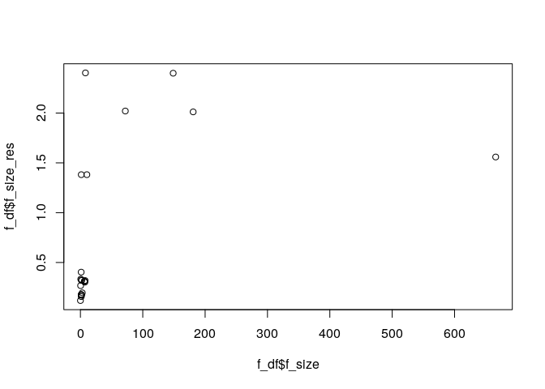
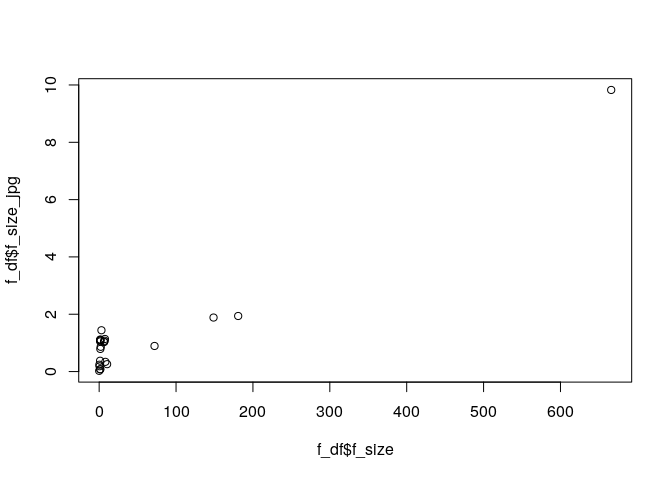
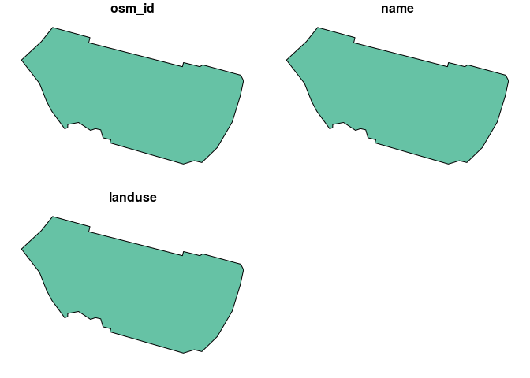
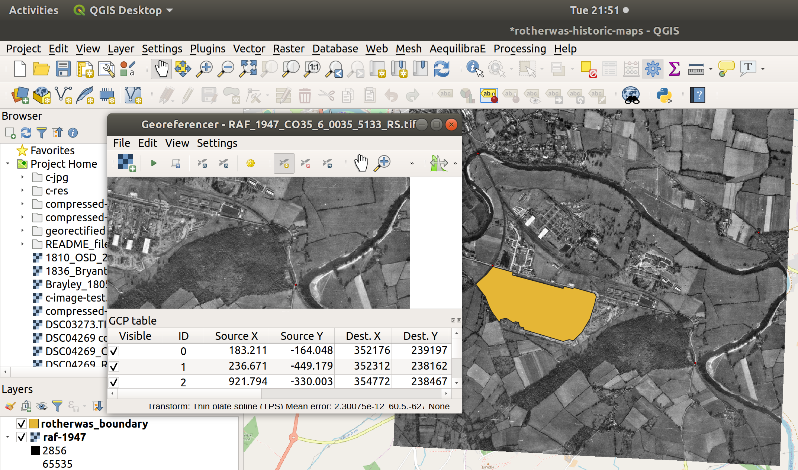
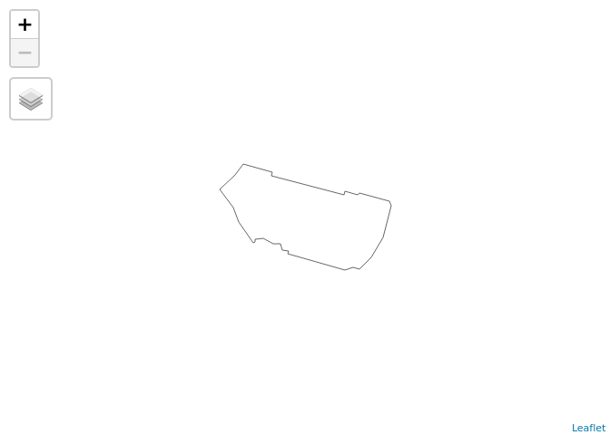

<!-- README.md is generated from README.Rmd. Please edit that file -->

# Creating interactive web maps from raster datasets in R

The examples below show how to create interactive maps, for publication
online, from old photos. Other resources explaining how to do this have
been created, including this:
<https://kokoalberti.com/articles/georeferencing-and-digitizing-old-maps-with-gdal/>

To run this code you’ll need the following R packages installed:

``` r
library(sf)
#> Linking to GEOS 3.7.1, GDAL 2.4.0, PROJ 5.2.0
library(tmap)
library(osmdata)
#> Data (c) OpenStreetMap contributors, ODbL 1.0. http://www.openstreetmap.org/copyright
tmap_mode("view")
#> tmap mode set to interactive viewing
```

## Data cleaning / preprocessing

The first stage is to check the size of datasets in your project.

``` r
ip = "\\.jpg|\\.JPG|\\.tif|\\.TIF"
f = list.files(path = ".", pattern = ip)
f_size = file.size(f) / 1e6
f_df = data.frame(f, f_size, stringsAsFactors = FALSE)
f_df = f_df[order(f_size, decreasing = TRUE), ]
# head(f_df)
```

|    | f                                                | f\_size |
| -- | :----------------------------------------------- | ------: |
| 20 | NLS\_40\_01.tif                                  |     666 |
| 22 | RAF\_1947\_CO35\_6\_0035\_5133\_RS\_modified.tif |     181 |
| 23 | RAF\_1947\_CO35\_6\_0035\_5133\_RS.tif           |     149 |
| 6  | DSC03273.TIF                                     |      72 |
| 2  | 1836\_Bryant\_combined.tif                       |      10 |
| 1  | 1810\_OSD\_204\_Hereford.tif                     |       8 |

Some of these are huge files. That is fine if time and computing
resources including RAM and internet bandwidth etc are not a problem
limitation. But for the purposes of testing and teaching methods, it
makes sense to compress the images before the other steps.

First we can do this by changing the resolution. In the next line of
code, we will set the maximum number of pixels, in X or Y dimensions, to
1000 pixels. This parameter will be used subsequently in the code.

``` r
px_max = 1000 # other max pixel values can be used here
```

To compress images from the command line you can use ImageMagick. We’ll
do this for the 5th largest image in the dataset, as follows:

``` r
j = 5
i = magick::image_read(f_df$f[j])
magick::image_info(i)
#> # A tibble: 1 x 7
#>   format width height colorspace matte filesize density
#>   <chr>  <int>  <int> <chr>      <lgl>    <int> <chr>  
#> 1 TIFF    2760   1244 sRGB       FALSE 10328844 240x240
ic = magick::image_resize(i, geometry = paste0(px_max, "x", px_max))
magick::image_info(ic)
#> # A tibble: 1 x 7
#>   format width height colorspace matte filesize density
#>   <chr>  <int>  <int> <chr>      <lgl>    <int> <chr>  
#> 1 TIFF    1000    451 sRGB       FALSE        0 240x240
magick::image_write(ic, "c-image-test.tif")
file.size(f_df$f[j]) / 1e6
#> [1] 10.32884
file.size("c-image-test.tif") / 1e6
#> [1] 1.381465
```

What just happened? We just reduced a 10 MB file to a 0.1 MB file, but
reducing the resolution. Now we can do this for all datasets (not run as
this is slow):

``` r
dir.create("c-res")
#> Warning in dir.create("c-res"): 'c-res' already exists
f_df$file_name_res = paste0("c-res/", f_df$f)
f_df$f_size_res = NA
# Note: uncomment the 3 commented lines below to run the compression code
for(j in 1:nrow(f_df)) {
  # i = magick::image_read(f_df$f[j])
  # ic = magick::image_resize(i, geometry = "1000x1000")
  # magick::image_write(ic, f_df$file_name_res[j])
  f_df$f_size_res[j] = file.size(f_df$file_name_res[j]) / 1e6
}
```

``` r
sum(f_df$f_size)
#> [1] 1132.156
sum(f_df$f_size_res, na.rm = TRUE)
#> [1] 17.21778
sum(f_df$f_size) / sum(f_df$f_size_res, na.rm = TRUE)
#> [1] 65.75502
plot(f_df$f_size, f_df$f_size_res)
```

<!-- -->

``` r
knitr::kable(head(f_df[c(1, 2, 4)]), digits = 0)
```

|    | f                                                | f\_size | f\_size\_res |
| -- | :----------------------------------------------- | ------: | -----------: |
| 20 | NLS\_40\_01.tif                                  |     666 |            2 |
| 22 | RAF\_1947\_CO35\_6\_0035\_5133\_RS\_modified.tif |     181 |            2 |
| 23 | RAF\_1947\_CO35\_6\_0035\_5133\_RS.tif           |     149 |            2 |
| 6  | DSC03273.TIF                                     |      72 |            2 |
| 2  | 1836\_Bryant\_combined.tif                       |      10 |            1 |
| 1  | 1810\_OSD\_204\_Hereford.tif                     |       8 |            2 |

Overall the code above has reduced the image data by more than 1 GB,
with the a maximum compressed file size of around 3 MB.

Another way to reduce the size of images is by saving them in a
compressed file format (.tif files can be compressed with GDAL, in this
case we will save them as .jpg files with the default quality settings).

``` r
dir.create("c-jpg")
#> Warning in dir.create("c-jpg"): 'c-jpg' already exists
f_df$file_name_jpg = gsub(pattern = ip, ".jpg", x = f_df$f)
f_df$file_name_jpg = paste0("c-jpg/", f_df$file_name_jpg)
f_df$f_size_jpg = NA
# Note: uncomment the 2 commented lines below to run the compression code
for(j in 1:nrow(f_df)) {
  # i = magick::image_read(f_df$f[j])
  # magick::image_write(i, f_df$file_name_jpg[j], quality = 30, format = "jpeg")
  f_df$f_size_jpg[j] = file.size(f_df$file_name_jpg[j]) / 1e6
}
```

``` r
sum(f_df$f_size_jpg)
#> [1] 28.9314
sum(f_df$f_size) / sum(f_df$f_size_jpg)
#> [1] 39.13241
plot(f_df$f_size, f_df$f_size_jpg)
```

<!-- -->

``` r
knitr::kable(head(f_df[c(1, 2, 6)]), digits = 0)
```

|    | f                                                | f\_size | f\_size\_jpg |
| -- | :----------------------------------------------- | ------: | -----------: |
| 20 | NLS\_40\_01.tif                                  |     666 |           10 |
| 22 | RAF\_1947\_CO35\_6\_0035\_5133\_RS\_modified.tif |     181 |            2 |
| 23 | RAF\_1947\_CO35\_6\_0035\_5133\_RS.tif           |     149 |            2 |
| 6  | DSC03273.TIF                                     |      72 |            1 |
| 2  | 1836\_Bryant\_combined.tif                       |      10 |            0 |
| 1  | 1810\_OSD\_204\_Hereford.tif                     |       8 |            0 |

This shows that saving the files in a compressed format, `.jpeg` with a
high compression ratio (quality can be increased by changing 30 to a
higher value, up to 100) has also reduced image sizes by more than 1GB.

We can use the raw input files, the lower resolution files, or the
compressed .jpeg files. With computational operations, it is often
sensible to try a method first on a small dataset and only after
tweaking the methods/settings on things that run quickly, run it on the
whole dataset.

We will use the smaller .tif files for now.

## Vector data

Vector data is available from a wide range of places. OpenStreetMap is a
good up-to-date source that has global coverage and is ever improving,
albeit with uneven quality, thanks to thousands of volunteers.

``` r
library(osmdata)
osm_data = opq(bbox = "hereford uk") %>% 
  add_osm_feature("name", "Rotherwas Industrial Estate") %>% 
  osmdata_sf()
rotherwas_boundary = osm_data$osm_polygons
class(rotherwas_boundary)
#> [1] "sf"         "data.frame"
plot(rotherwas_boundary)
```

<!-- -->

``` r
# write_sf(rotherwas_boundary, "rotherwas_boundary.geojson") # save the file
```

We can plot this in an interactive mapping environment as follows:

``` r
tm_shape(rotherwas_boundary) +
  tm_borders()
```

<!-- -->

## Georectification

QGIS can georectify images using the [Georeferencer
plugin](https://docs.qgis.org/testing/en/docs/user_manual/plugins/plugins_georeferencer.html),
as illustrated below.

<!-- -->

The small .tif files that were created using the methods above were
saved in a folder called `georectified`. Note: you can remove black
edges and reduce files sizes in QGIS’s save options, which is an
interface to GDAL settings.

## Tiling

To create a ‘slippy map’ that users can zoom in and out, we can build a
tile pyramid with GDAL. We will do this from a shell, in this case
`bash`, the default shell on many Linux systems (see
<https://gdal.org/programs/gdal2tiles.html> for details)

``` bash
gdal2tiles.py --zoom=2-18 -r near georectified/raf-47.tif t-raf-47
```

This tiled results can be viewed by opening the file
`raf-1947-tiles/leaflet.html`, which looks like this:

``` r
browseURL("t-raf-47/leaflet.html", browser = "firefox")
```

<!-- -->

## Serving the tiles

Tiles can be served simply by uploading them somewhere that will allow
people to access the static .tif files, a ‘static file server’ that does
not need to do anything with the files. One way of doing this is using
GitHub’s free ‘gh-pages’ file serving system. After creating a new repo,
this can be done as follows from `bash` (source: the
[deploy\_site\_github
vignette](https://pkgdown.r-lib.org/reference/deploy_site_github.html)
from the pkgdown R package)

``` bash
git clone git@github.com:foss4lh/rotherwas-tiles.git
cd rotherwas-tiles
git checkout --orphan gh-pages
git rm -rf .
git commit --allow-empty -m 'Initial gh-pages commit'
git push origin gh-pages
cd ..
cp -Rv t-raf-47 rotherwas-tiles
```

Once you have pushed the new tiles online, you can see them, e.g. from
here:
<https://foss4lh.github.io/rotherwas-tiles/t-raf-47/15/16137/21947.png>

Now we can use the route of the URL for these tiles to create an
interactive
map:

``` r
tiles_url = "https://foss4lh.github.io/rotherwas-tiles/t-raf-47/{z}/{y}/{x}"
tm_basemap(tiles_url, tms = TRUE) +
tm_shape(rotherwas_boundary) +
  tm_borders() +
  tm_tiles(server = tiles_url, tms = TRUE) +
  tm_view(set.zoom.limits = c(14, 15))
```

<!-- -->
